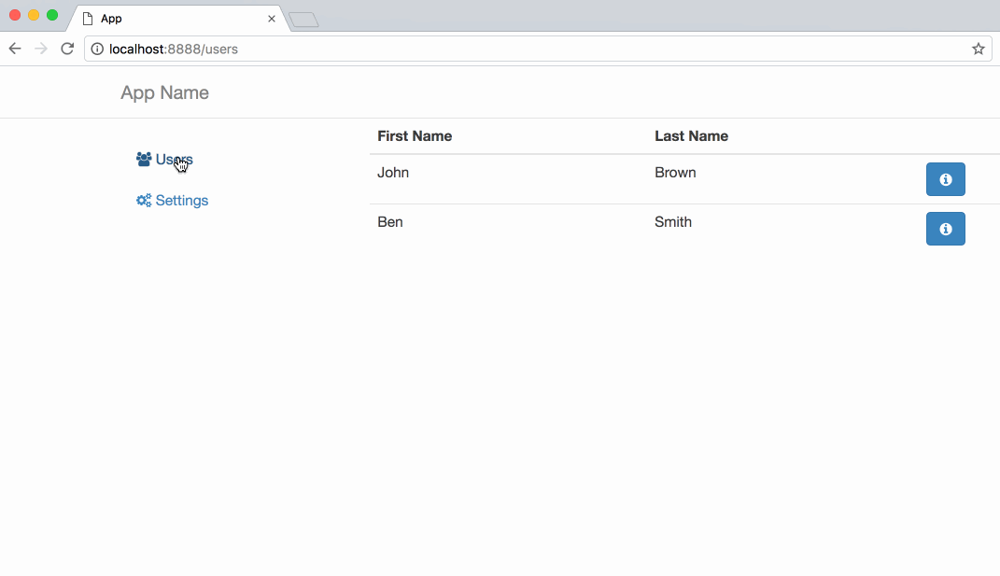

# Ready-to-use template for a TypeScript application.



This is an example of TypeScript application that uses:

* TypeScript 
* React.js
* React-router
* MobX
* Rx.js
* Jest
* webpack 1
* tslint

It can be used as a template for a new application.

## Requirements

* node.js >=7

## How to start

* Run fake backend 

```$bash
cd ./backend-mock
npm install
npm run serve
```

* Run the app

```$bash
cd ./app
npm install
npm run dev
```
Open http://localhost:8888 in a web browser.

## How to build

TODO

## License

The MIT License (MIT)

Copyright (c) 2017 Dmitry Fedosov

Permission is hereby granted, free of charge, to any person obtaining a copy of this software and associated
documentation files (the "Software"), to deal in the Software without restriction, including without limitation the
rights to use, copy, modify, merge, publish, distribute, sublicense, and/or sell copies of the Software, and to permit
persons to whom the Software is furnished to do so, subject to the following conditions:

The above copyright notice and this permission notice shall be included in all copies or substantial portions of the
Software.

THE SOFTWARE IS PROVIDED "AS IS", WITHOUT WARRANTY OF ANY KIND, EXPRESS OR IMPLIED, INCLUDING BUT NOT LIMITED TO THE
WARRANTIES OF MERCHANTABILITY, FITNESS FOR A PARTICULAR PURPOSE AND NONINFRINGEMENT. IN NO EVENT SHALL THE AUTHORS OR
COPYRIGHT HOLDERS BE LIABLE FOR ANY CLAIM, DAMAGES OR OTHER LIABILITY, WHETHER IN AN ACTION OF CONTRACT, TORT OR
OTHERWISE, ARISING FROM, OUT OF OR IN CONNECTION WITH THE SOFTWARE OR THE USE OR OTHER DEALINGS IN THE SOFTWARE.